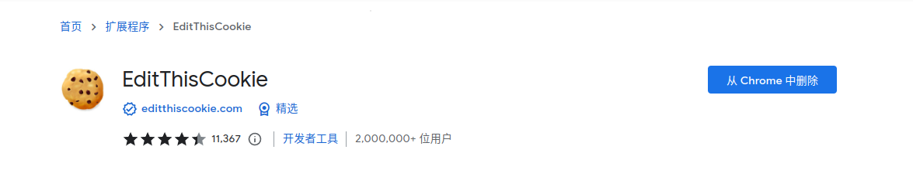
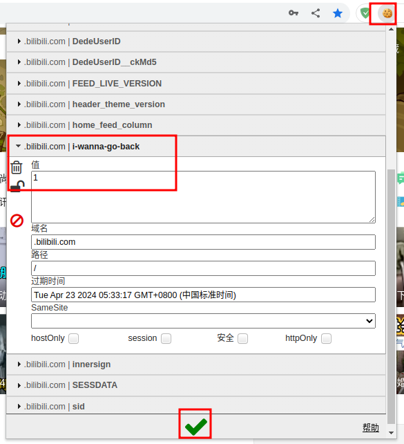

## 介绍

B站的网页端换上了新版的 UI 界面，个人不太适应，感觉对比度和字体有些不舒服，并且动画的流畅度也不太比得上以前，因此个人使用还是会换成旧版本，不过最近B站逐渐移除了在首页直接退回旧版的方案，现在要回到旧版的话需要修改 Cookie，可以利用浏览器插件完成这个任务。

## 准备工作

在 Chrome 应用商店搜索找到 `EditThisCookie` 插件，直接安装即可

## 更改 Cookie

打开B站首页，在浏览器拓展栏中打开插件，然后找到 `i_wanna_go_back` 项，将值改为 `1` ，然后点击下面的绿色的 ✔️ 完成保存，接下来刷新浏览器就可以回到旧版 UI 风格了

## 结束

B站网页端逐渐推进新 UI 的落地，如果新 UI 做的好倒也罢了，现在的新 UI 是真的让我喜欢不起来，希望B站能够一直保留旧版 UI 的入口吧，恋个旧……
