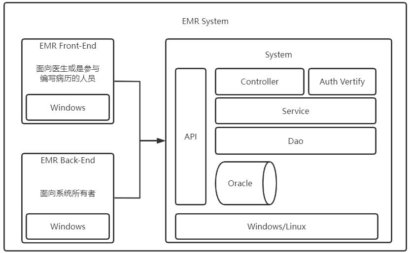
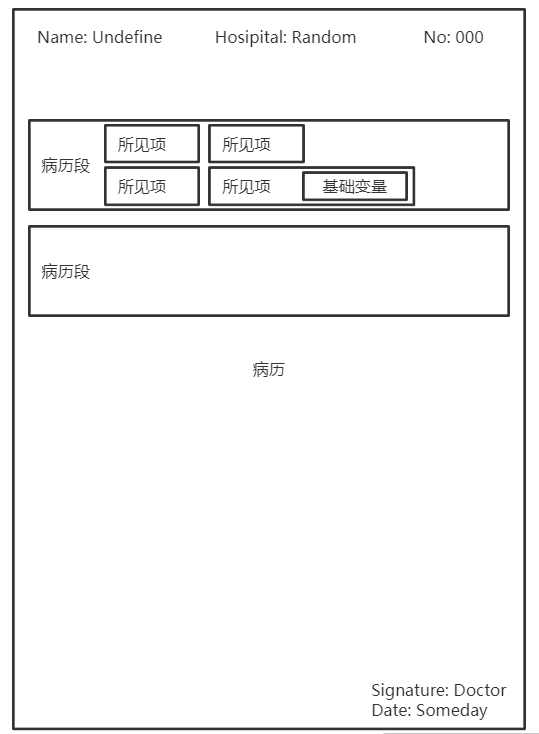

## 病历

病历记录了患者从开始就诊到结束治疗之间的所有医学信息，病历并非指单独的一份记录文档，而是就诊期间按照医疗规范所产生的的一系列文档的集合


## 电子病历

电子病历指将传统的纸质病历以信息化的手段进行管理，信息化过程有如下一些麻烦

- 医学上的各类专业表述非常复杂，如果不对大量可靠的病历进行分析，病历结构化的工作会非常受限
- 病历中存在非常多的主观表述文本，对这部分的信息进行结构化较为复杂
- 对于开发人员而言，医学比较陌生，理解医疗的基本业务逻辑以及医学的专业概念所需学习成本高昂，这会导致开发过程较为困难

## 一种EMR系统的介绍

### 前言

工作原因接触到EMR系统，借此机会进行分析

### 系统架构

**由于并未实际看到系统源码，所以无法保证这部分内容的准确性，实际上大部分内容都是猜测的。。。**

按照一般的医疗系统开发规模来看，系统至少有一套面向用户（在EMR系统用户就是医生或是参与编写病历的人员）的前端界面，以及一套面向EMR系统管理者的后端界面还有就是数据库，考虑到数据的规模，选择了Oracle数据库。



上图非常简单，大致了解即可，下面说一下该系统对结构化病历提出的解决方案

### 解决方案

#### 病历信息化




如上图所示，一份病历的结构大致如此，从文档表达的信息来看，每个加粗的标题就是一个父节点，在父节点的基础上添加各类子节点就可以构成一份电子病历，和Json以及Yaml这类树形数据结构有相似之处

```json
{
    title: '入院记录',
    content: {
        // 数据段
        data_field: {
            // 姓名
            name: 'xxx',
            // 性别
            gender: 0,
            // 主诉
            chief_complaint: {
                // 咳嗽
                cough: {
                    // 基础变量
                    number: 7,
                    unit: 'day'
                }
            },
            // 现病史
            cur_medical_record: {
            }
        },
        // 签名段
        signature_field: {
            
        }
    }
}
```

#### 具体思路

实现电子病历的第一个重点在于，调查统计实际医疗活动中所产生的病历类型，从树形数据结构的角度来说，病历类型属于根节点，提前区分不同的病历可以提供模板化后续节点的支持

实现电子病历的第二个重点在于，需要统计出实际医疗过程中产生的病历有哪些病历段，并且以一种合理的规则将其分门别类，因为病历段作为除根节点外第二大的节点，它同样必须具有足够的区分度才能为后续子节点的划分做好基础，而且它还需要满足实际医疗活动中真实的业务上的需求

第三个重点在于拆分各类主观的医学描述，使其能够规范表述，便于计算机进行后续分析。如上述病历的现病史部分，涉及到时间限定，症状描述，专业医学词汇还有连接词的运用等。不同于前面两个部分起到的数据分类的作用，这一部分接近叶子节点，承载了主要的信息，这里要尽量避免多行文本的出现，这会导致病历信息化的核心功能，数据统计分析受到影响，按照该系统的实际实现，大致把数据类型分为了“单选”，“数字”，“日期时间”，“文本”几类

#### 带来的影响

按照上述标准完成病历信息化后，可以实现以下一些功能

- 病历规范化
- 病历数据统计
- 病历质量控制

### 流程分析

#### 启动流程

- 初始化系统配置信息，如配置CORS，设置Token验证，注册服务到容器，设置一些系统变量等等

- 扫描添加机器码`WebEmrService/wwwroot/License/lic.text`

  如果不存在则在`wwwroot/Views/emr/write/data/lic.text`目录下创建一个新的`lic.text`文件

- `lic.text`中是一个被加密的JSON对象，结构如下

  ```json
  {
      'machineCode': String,
      'currentTime': String
  }
  ```

  其中`machineCode`是`ZLBase.SharedLibrary`提供的`GenerateMachineCode`方法提供的，对应了运行应用的机器的机器码

- 如果存在`lic.text`文件，那么比对本机机器码和`lic.text`文件中的授权码，相同则继续流程。否则提示授权信息错误

#### 创建模板病历

- 浏览器中输入如下地址`localhost:8120/MrManagement/MRTemplateManage`，这里是病历模板管理页面，可以添加新的病历模板
  在新增页面选择一个基础模板和病历类型，可以在右边看到即时渲染的文档模板样式，然后可以编辑病历段来适应需求，在之后的请求中，文档会作为参数传递到后端，以下是文档模板的数据结构

  ```json
  {
      'TEMPLATE_ID': String,
      'TEMPLATE_TYPE_ID': Number,
      'TEMPLATE_TYPE': String,
      'TYPE_ID': String,
      'TYPE_Name': String,
      'TEMPLATE_CODE': String,
      'TEMPLATE_NAME': String,
      'APPLY_TYPE': String,
      'CREATOR': String,
      'EDITOR': String,
      'NOTE': String,
      'BASIC_TEMPLATE_ID': String,
      'PRINT_CONTROL':  String,
      'TEMPLATE_VERSION': String, 
      'IS_SEND_CDA': Boolean,
      'IS_SEND_PDF': Boolean
  }
  ```

  需要注意的是，病历模板仅指出了结构，不带有实际数据，因此可以用一个JSON对象将其表述，实际的病历在模板的基础之上添加了很多数据，是以HTML文档的结构展示的。

- 点击保存按钮，查看JS代码，`savepara`转化成JSON字符串后作为参数传到`/MrTemplate/SaveTemplateRelatedInfo`接口

  ```javascript
  var ret = zlPost("/MrTemplate/SaveTemplateRelatedInfo", JSON.stringify(savepara), "");
  ```

  后端接口部分，`[HttpPost]`类似Java中的`@PostMapping`注解，指出方法接受的请求类型，方法名和控制器名直接构成了接口地址，参数将转化成`MrTemplate`类的对象，最后就是按照三层架构的模式，将其写入数据库。

  ```c#
  [HttpPost]
  public IActionResult SaveTemplateRelatedInfo([FromBody] MrTemplate templateInfo)
  {
      MrTemplateBLL mrTemplateBLL = new MrTemplateBLL();
      // BLL类似Java中的Service层
      string result = mrTemplateBLL.SaveTemplateRelatedInfoBLL(templateInfo);
      return Ok(result);
  }
  ```
  
  

