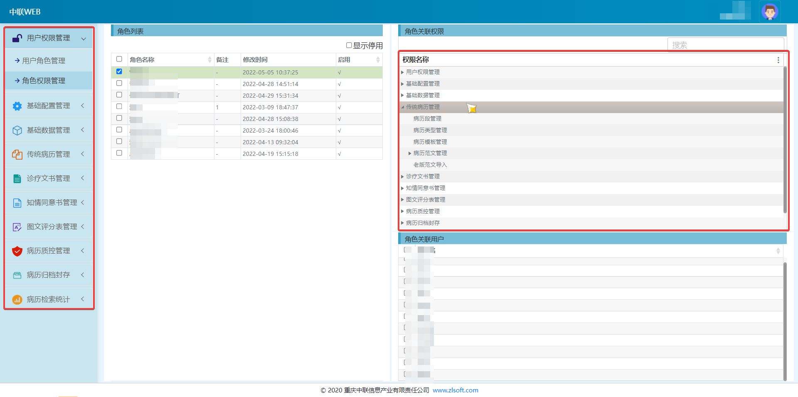

## 病历

病历记录了患者从开始就诊到结束治疗之间的所有医学信息，病历并非指单独的一份记录文档，而是就诊期间按照医疗规范所产生的的一系列文档的集合

## 电子病历

电子病历指将传统的纸质病历以信息化的手段进行管理，信息化过程有如下一些麻烦

- 医学上的各类专业表述非常复杂，如果不对大量可靠的病历进行分析，病历结构化的工作会非常受限
- 病历中存在非常多的主观表述文本，对这部分的信息进行结构化较为复杂
- 对于开发人员而言，医学比较陌生，理解医疗的基本业务逻辑以及医学的专业概念所需学习成本高昂，这会导致开发过程较为困难

## 一种EMR系统的介绍

### 前言

工作原因接触到EMR系统，借此机会进行分析

### 系统架构

**由于并未实际看到系统源码，所以无法保证这部分内容的准确性，实际上大部分内容都是猜测的。。。**

按照一般的医疗系统开发规模来看，系统至少有一套面向用户（在EMR系统用户就是医生或是参与编写病历的人员）的前端界面，以及一套面向EMR系统管理者的后端界面还有就是数据库，考虑到数据的规模，选择了Oracle数据库。

上图非常简单，大致了解即可，下面说一下该系统对结构化病历提出的解决方案

### 解决方案

#### 基础功能

和一般的管理系统一样，该系统也提供了基本的到功能级的权限控制

如上图所示，角色根据权限渲染对应的菜单，并不清楚后端有没有做请求拦截验证来防止绕过前端直接请求的攻击

#### 病历信息化

