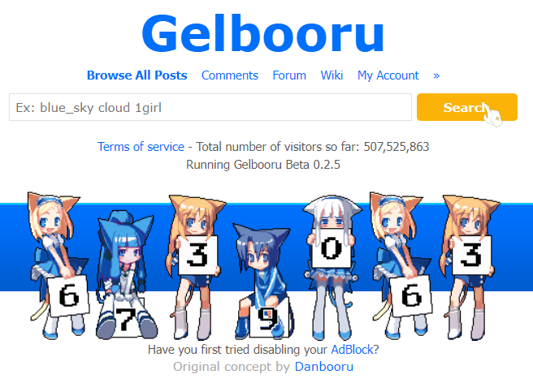
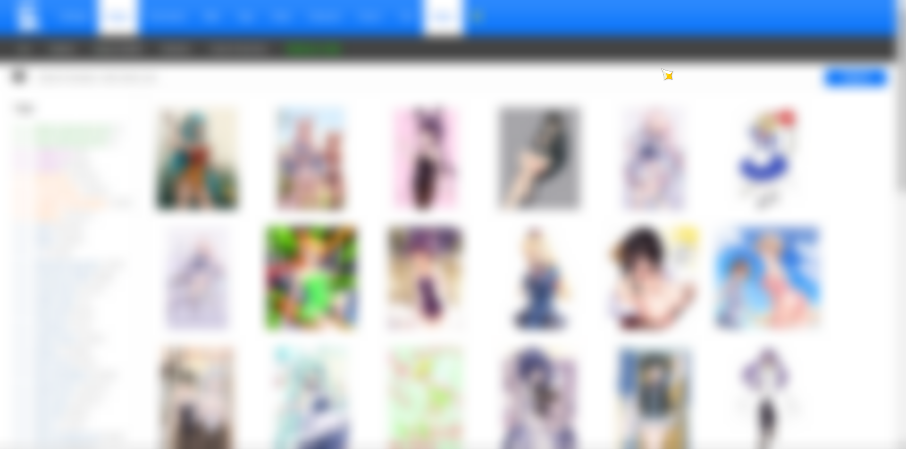
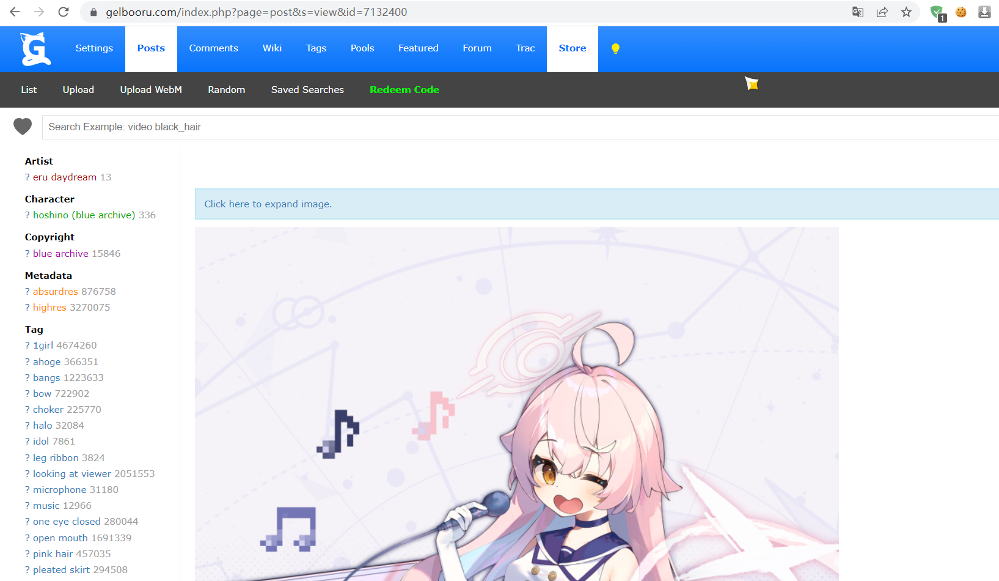
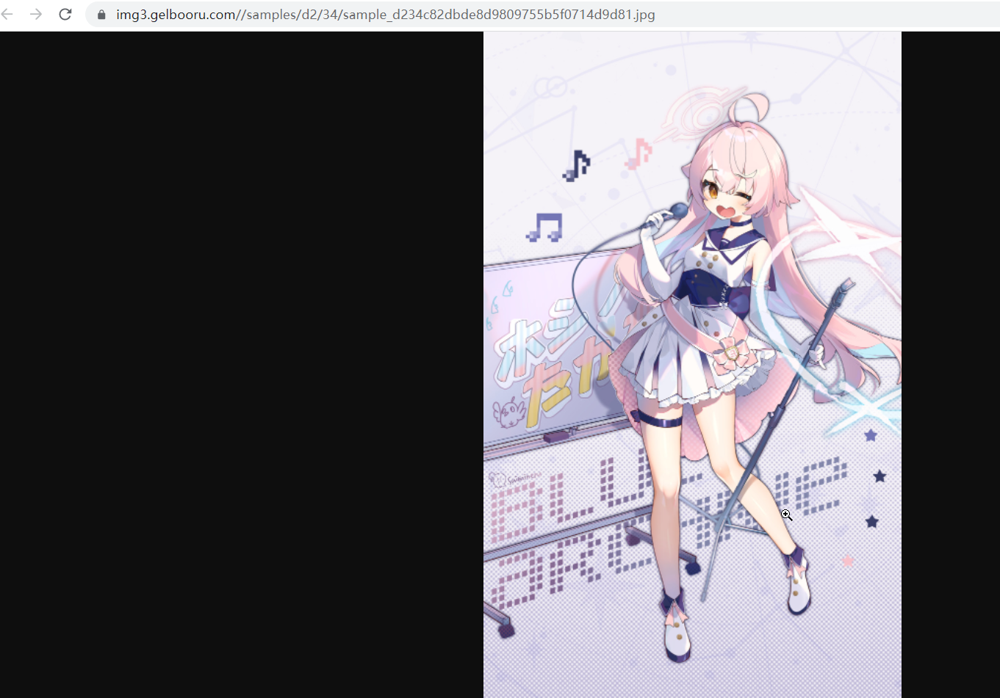
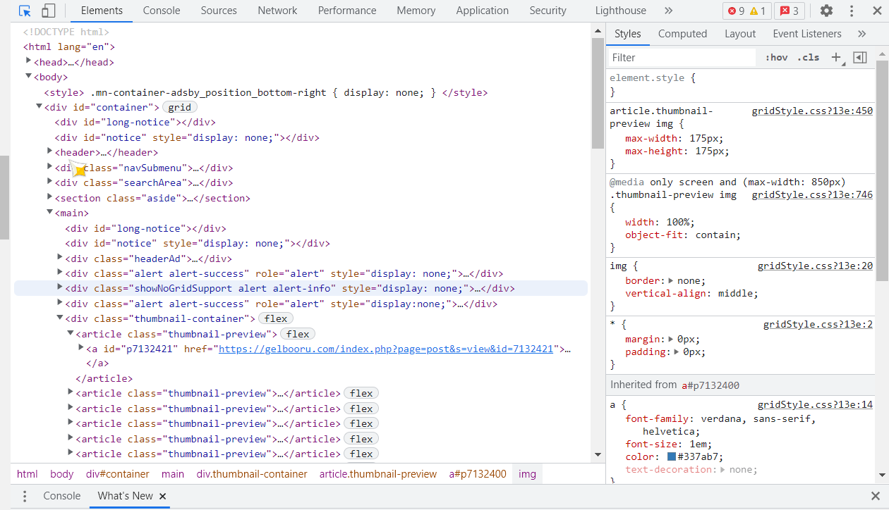
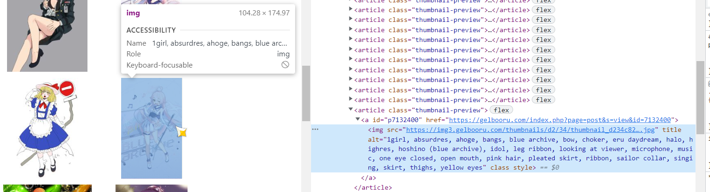

## 起步

此次试验是为了探索一种获取Gelbooru图片的有效的方式

我先去调查了一下Gelbooru是否有提供相关的API用于开发，和sauceNAO不同，Gelbooru并没有提供专用于第三方开发用的API，但是Gelbooru提供了API key，当你登陆了Gelbooru的个人账户后，可以在设置页面找到你的API Key，这说明Gelbooru是允许第三方开发的，但是和sauceNAO的区别在于：

- 没有提供API文档，sauceNAO具有详细的参数和返回结果说明
- 没有告知明确的API接口

这意味着第三方开发者需要自己利用Postman或者相关工具来对Gelbooru进行分析。

## 初步成果

简单的使用Chrome浏览器的开发者工具，可以看到用户在使用Gelbooru时涉及到的网络请求URL以及返回的结果，下面将罗列一些测试结果。

### 主页进入



如果不输入任何参数点击主页的`search`按钮，Gelbooru将会跳转至随机的结果页面



此时地址栏的URL是这样的

```html
https://gelbooru.com/index.php?page=post&s=list&tags=all
```

测试一下过后得到了这样的一个结果

```yaml
page: 页面类型，有account,post,comment,wiki,tags,pool,extras,forum,tracker
s: 大概是指展示的形式，有list,view,artist等等
tags: 搜索条件标签，用下划线连接词，空格分隔词
```

### 图片页面

本次网络的测试重点在于获取图片页面和实际图片URL之间的关系，因此只讨论post页面，接下来以这张碧蓝档案的同人图为例



在地址栏中显示这里的页面为

```html
https://gelbooru.com/index.php?page=post&s=view&id=7132400
```

可以看到，先前的`s=list`现在变成了`s=view`，字面意思就是列表模式换成了视图模式

除此之外，这里引入了一个新的参数`id`，这个id并不是指这张图的id，而是这张图所在页面的id，实际上用来表示这张图的URL需要你点击这张图去确认

右键这张图片，选择`在新标签页中打开图片`



如上图所示，URL显示的是

```html
https://img3.gelbooru.com//samples/d2/34/sample_d234c82dbde8d9809755b5f0714d9d81.jpg
```

而这也是你实际去下载图片所用到的URL，这个URL有一定规律可循，首先是主域名`img3.gelbooru.com`这个应该是Gelbooru的图片代理站，后面接着的会是`sample`或者`image`，具体接什么我没有搞清楚规律，似乎判断的是原图或者是缩放图，然后是`/d2/34/sample_d234c82dbde8d9809755b5f0714d9d81.jpg`，后面看上去是像这张图的MD5信息，然后拆出来前4位加上`sample`或是`image`就构成了完整的图片URL

## 解决方案

回到试验的目的来看，获取图片关键是在于获取图片的直接URL，根据上文的描述，最直观的一个思路就是利用代码来解析Gelbooru返回的HTML页面，从中获取必要的数据，以下简述以下思路

Gelbooru的Post页面包含了非常多的信息，包括缩略图的URL以及对应图片的id还有图片的MD5值，有了这些信息基本上就可以完成图片请求的大多数操作了





如上两张图所示，从首页进入到图片相关的HTML区域非常简单，基本上是一些固定结构，如Java可以利用Jsoup非常容易的获取到`thumbnail_container`标签，接下来就可以直接利用`img`标签内的`src`属性来获取缩略图和原始图片了

## 后续

这是后来才发现的，Gelbooru 其实有提供 API ，不过要想获得 Json 格式的数据需要修改一下参数，并且需要自己注册 Gelbooru 的账号，然后拿到自己的 API KEY 才行，比解析 xml 是要好的多啦

```
https://gelbooru.com/index.php?page=dapi&s=post&q=index&api_key=your_key&user_id=your_id&json=1
```

基本上是这个样子去请求，然后具体的返回格式以及参数啥的可以参考这个链接

https://gelbooru.com/index.php?page=wiki&s=view&id=18780
