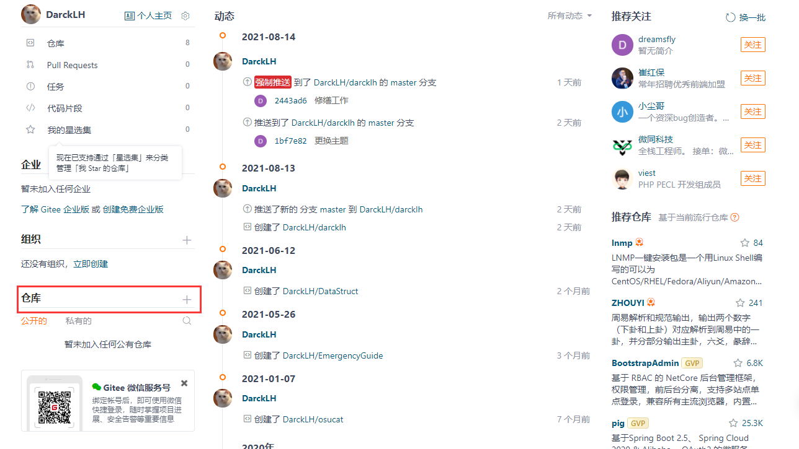
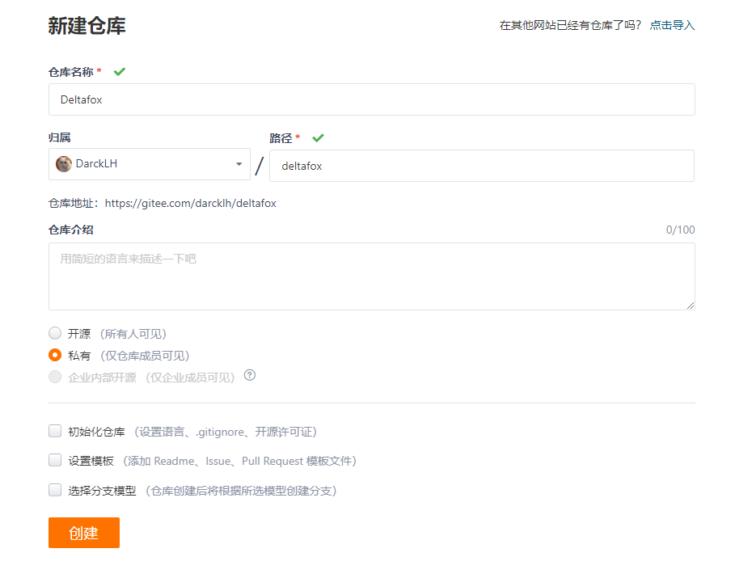
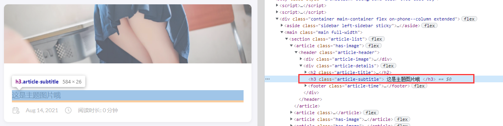
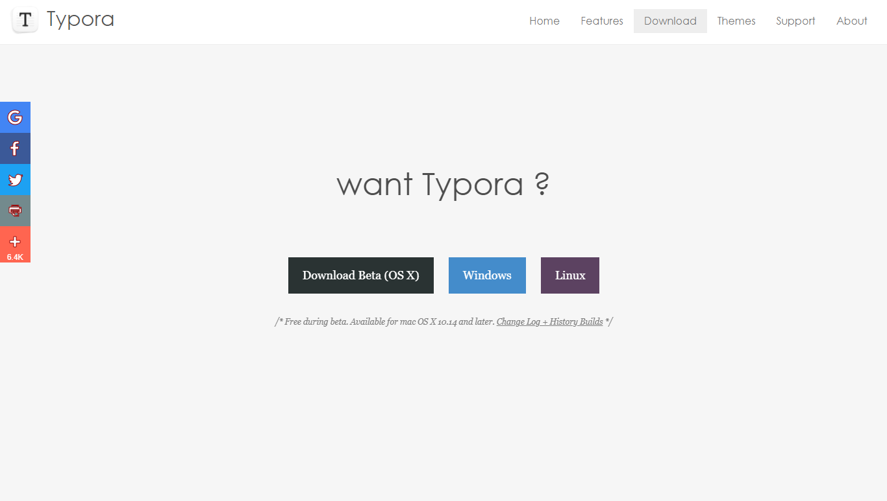
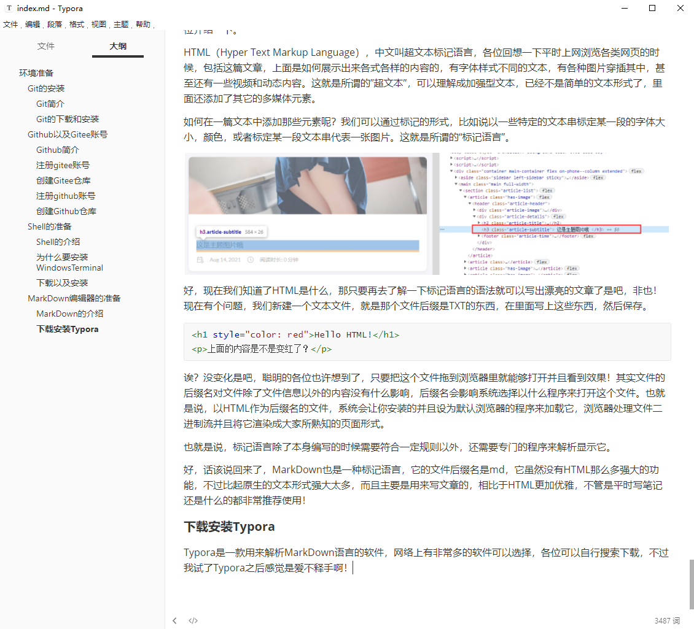

## 环境准备

在正式开始上手前，我们需要做一些环境准备，何谓“环境"？

程序其实就像一种生物，鱼需要水，植物需要阳光，绝大部分动物都需要氧气，除了必备的生存条件之外还可以准备一些辅助的条件让生物更加满足，这些都可以称之为环境。这一部分主要是介绍搭建博客必要的环境，请准备好网络环境以及电脑。

1. git（必要，进行代码管理必不可少的工具）
2. Github（必要，这篇教程主要就是借助github代码托管实现个人博客）
3. Gitee码云 （Github的替位选择，推荐国内环境用户使用）
4. Shell（Windows平台推荐WindowsTerminal）、
5. MarkDown编辑器（MarkDown是一种标记语言，写文章会用到）
6. 善于思考的大脑和愿意付出行动的双手

------
------

### Git的安装

#### Git简介

git是一个分布式版本控制软件，最初由林纳斯·托瓦兹创作，于2005年以GPL发布。最初目的是为更好地管理Linux内核开发而设计。应注意的是，这与GNU Interactive Tools不同。 git最初的开发动力来自于BitKeeper和Monotone。 [维基百科](https://zh.wikipedia.org/zh-cn/Git)

上面这堆谜语来自wiki，举例说明吧。

好比你装一台电脑，整个过程存在非常多的状态，甚至装完之后还需要升级维护之类的需求。如果中间出了问题就要拆掉已经装好的部分回到出错的状态重新来过，非常折磨！现在出现了这么一个工具，它可以记录下一个时空节点的所有信息，比如在你装好CPU，装好内存，装好显卡的每个结束时刻你都可以记录下这一时空节点，还可以带上一些你的辅助信息，说明为啥要记录这个节点以及在这个节点你都做了些什么。这样当你出现了什么问题的时候你可以快速的检查到底出啥问题了，甚至返回到之前的时空节点将其修复！是不是非常酷炫？这还不是最酷的，结合下文会讲到的Github，甚至可以做到让别人克隆你的时空节点记录，将他的时空记录和你的合并起来！真是令人激动。当然，Git的进一步使用就需要各位深入学习了，此处只是为了方便大家理解后面的命令都在做什么。

#### Git的下载和安装

[官网地址](https://git-scm.com/)

根据自己系统选择，推荐选择Setup安装程序，下面的是便携版，涉及到环境变量注册表这些，不推荐萌新使用，下载下来后双击运行。保持默认选项一冲到底即可！当然，你也可以选择网络上查询相关资料再做决定。

安装完成过后你可以在任何一个地方鼠标右键看到这两个选项，这就代表安装完成了。

有关Git的上手使用可以参考我的另一篇文章！

------

------

### Github以及Gitee账号

------

#### Github简介

GitHub是通过Git进行版本控制的软件源代码托管服务平台，由GitHub公司的开发者Chris Wanstrath、P. J. Hyett和汤姆·普雷斯顿·沃纳使用Ruby on Rails编写而成。 GitHub同时提供付费账户和免费账户。这两种账户都可以创建公开或私有的代码仓库，但付费用户支持更多功能。 [维基百科](https://zh.wikipedia.org/zh-cn/GitHub)

wiki对于完全没有基础的人确实有点麻哦，还是举例说明吧。

比如你是一个画家，你非常喜欢在网络上分享自己的绘画作品，有一天你突然萌生了一个奇妙的想法，假如我可以发布我作品的源文件，让大家一起来完成作品会怎么样？于是你发布了作品的psd或者是其它可以编辑的文件到一个网络上的仓库中，并且告诉所有人可以随意编辑你这个仓库里的作品。现在，其他人就可以下载你的作品，在他们的电脑上完成了工作后再发布到你的作品仓库里，或者单纯下载下来欣赏使用，这是开源的体现。

网络上建立仓库（存储空间）是需要消耗资源的，github提供给了用户一定的免费资源，大量用户之间则构建起了一个交流的社区，然后把这个例子中的绘画作品换成代码就可以简单理解github以及开源社区是什么了。

------

#### 注册gitee账号

国内网络环境比较推荐gitee，方便且速度快，中文环境便于学习使用。缺点就是考虑到国内政治因素以及各类安全需求有比较多的限制，也需要实名认证，当然这其实无可厚非，看各位如何取舍吧。

访问[码云](https://gitee.com/)注册

请仔细阅读gitee给出的说明哦，个人空间取个好点的名字。注册完后登陆，然后按照网页的提示把手机号码绑定，还有实名认证，请准备好身份证的正反面各一张，还有一张手持身份证的照片（电脑上推荐大家平时就准备好这些证件照放在一个文件夹里，便于取用，在手机上访问网页的话也许可以直接拍照上传），实名认证需要大约1-2个工作日完成，完成过后才能启用gitee的页面托管服务。

------

#### 创建Gitee仓库

登录到你的个人首页，点击左下角的加号按钮

这个仓库名最好和你注册时填写的个人空间名一样哦，这样的话你就可以直接通过这种形式http://darcklh.gitee.io/的域名访问你的个人博客，否则好像是还要加上一个2级域名，其它的保持默认选项即可，后面有变化也可以修改。注意到右上角的导入了吗，gitee可以直接同步github的仓库，要善于利用哦！

------

#### 注册github账号

访问这个链接github.com，来到github官网，找到右上角的Sign up按钮。

接下来就是github的注册信息界面了，做的很漂亮，如果网络条件不好的话请多等待一下，或者挂上梯子再试试。这部分不予赘述，就是一个注册流程，也没啥限制的。

完成注册后来到个人的首页。

------

#### 创建Github仓库

有了账号还需要仓库来存放你的博客，创建仓库也是非常简单的，但是注意个人博客类的仓库命名需要一定规范，这就是唯一需要注意的地方了。点击那个Repositories按钮，然后New

命名规范就是，仓库名一定是你的用户名加上.github.io，这是GitHub解析用户界面的强制要求。其它选项保持默认就可以了，不用管。我这里报红是因为我已经有这个仓库了，各位应该不会有啥问题，建好仓库后先把它撂在这不管，还有一些准备工作要做。

------

------

### Shell的准备

#### Shell的介绍

什么是Shell呢？计算机在早期的时候是没有这么多花花绿绿的界面让你来用的，所有的操作都是通过shell（终端）来完成的，比如复制一个文件到另一个目录这样简单的操作，就需要在一个黑黑的窗体里完成，各位也许在Windows里接触过这个黑窗体，没错，CMD其实也是一个Shell（终端）。

那你可能会问，为啥不做一个界面出来呢，不是会方便很多吗？首先是图形化的界面消耗的资源比较高，在服务器上大家早就习惯了一套命令式的交互，没有必要去做一套费力又不咋讨好的图形界面，所以很多软件都是没有图形化界面的，包括系统也是，Linux这类服务器系统大部分都没有做图形化界面的，当然你可以自己安装图形界面。再者就是对于熟练的程序员来说使用命令交互比图形界面快多了，等待图形界面加载的时候就已经使用节约数十倍的资源占用的终端完成操作了。

------

#### 为什么要安装WindowsTerminal

Windows的CMD不够用，丑（

------

#### 下载以及安装

有两种方式，最简单的，在开始菜单里打开你的Windows应用商店，搜索WindowsTerminal安装即可

或者你可以来到这个仓库的发行地址[下载WindowsTerminal](https://github.com/microsoft/terminal/releases/tag/v1.9.1942.0)，翻到页面底部，下载第一个文件，下载下来直接双击即可，这个我记得是UWP应用形式的。

完成安装过后可以按下<kbd>Win</kbd>+<kbd>R</kbd>打开运行窗口，输入wt回车即可打开Shell

也可以通过点击右键菜单里的WindowsTerminal选项在右键所点击的目录打开Shell

------

------

### MarkDown编辑器的准备

#### MarkDown的介绍

在解释MarkDown之前我们需要先了解一下HTML是什么，了解互联网技术的可以跳过，这部分给初次接触的各位介绍一下。

HTML（Hyper Text Markup Language），中文叫超文本标记语言，各位回想一下平时上网浏览各类网页的时候，包括这篇文章，上面是如何展示出来各式各样的内容的，有字体样式不同的文本，有各种图片穿插其中，甚至还有一些视频和动态内容。这就是所谓的”超文本”，可以理解成加强型文本，已经不是简单的文本形式了，里面还添加了其它的多媒体元素。

如何在一篇文本中添加那些元素呢？我们可以通过标记的形式，比如说以一些特定的文本串标定某一段的字体大小，颜色，或者标定某一段文本串代表一张图片。这就是所谓的“标记语言”。

好，现在我们知道了HTML是什么，那只要再去了解一下标记语言的语法就可以写出漂亮的文章了是吧，非也！现在有个问题，我们新建一个文本文件，就是那个文件后缀是TXT的东西，在里面写上这些东西，然后保存。

~~~html
<h1 style="color: red">Hello HTML!</h1>

上面的内容是不是变红了？

~~~

诶？没变化是吧，聪明的各位也许想到了，只要把这个文件拖到浏览器里就能够打开并且看到效果！其实文件的后缀名对文件除了文件信息以外的内容没有什么影响，后缀名会影响系统选择以什么程序来打开这个文件。也就是说，以HTML作为后缀名的文件，系统会让你安装的并且设为默认浏览器的程序来加载它，浏览器处理文件二进制流并且将它渲染成大家所熟知的页面形式。

也就是说，标记语言除了本身编写的时候需要符合一定规则以外，还需要专门的程序来解析显示它。

好，话该说回来了，MarkDown也是一种标记语言，它的文件后缀名是md，它虽然没有HTML那么多强大的功能，不过比起原生的文本形式强大太多，而且主要是用来写文章的，相比于HTML更加优雅，不管是平时写笔记还是什么的都非常推荐使用！

#### 下载安装Typora

Typora是一款用来解析MarkDown语言的软件，网络上有非常多的软件可以选择，各位可以自行搜索下载，不过我试了Typora之后感觉是爱不释手啊！软件功能足够方便，界面非常漂亮干净，软件和官网都透露着一种性冷淡的文艺的气息。[Typora官网](https://typora.io/)

打开官网来到页面底部，或者点击右上角的Download跳过来，选择自己的系统（Windows），然后在下一个页面选择64位或者是32位下载，之后就是运行安装程序即可啦！

------

------

## 总结

第一篇的内容其实很简单，跟着走就完事了，写的可能有点啰里啰嗦的。

因为我自己是从一点都不懂的程度慢慢学过来的，所以我非常理解想要接触这个领域的萌新入门时会遇到很多特别基础的问题，但是由于知识体系是零散的，萌新很难自己构建起来一套理解网络基础的体系，来解决这些基础的问题。

所以我花大量篇幅尽量介绍清楚整个体系是怎么一回事，一方面是我自己加强理解和复习，另外一方面就是帮助各位萌新从这个搭建博客的流程中窥探学习到网络技术的一些基础知识。

如果说整个流程都只是叙述做什么，怎么做，却没有说明为什么，那其实这系列文章就是我自己写出来爽罢了，没啥实际意义。

要是能帮到各位就太好了！

