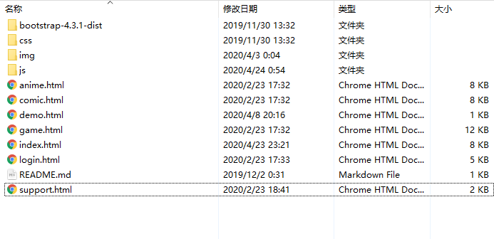
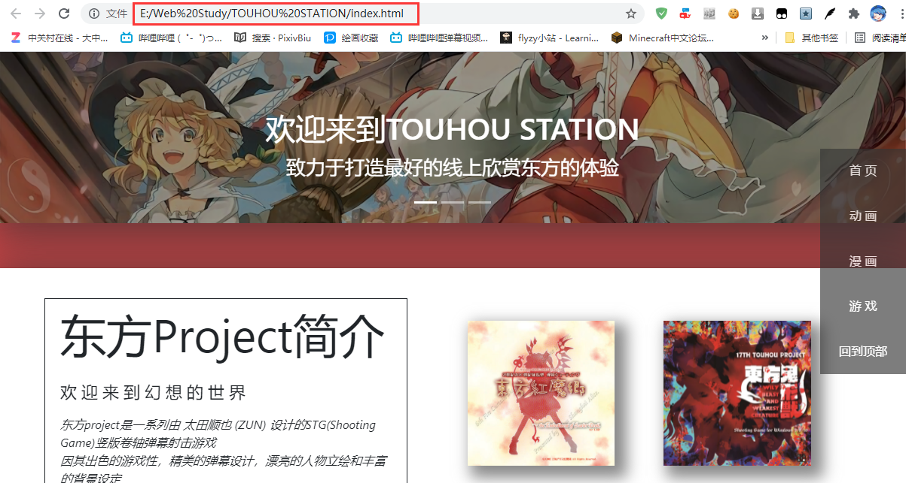
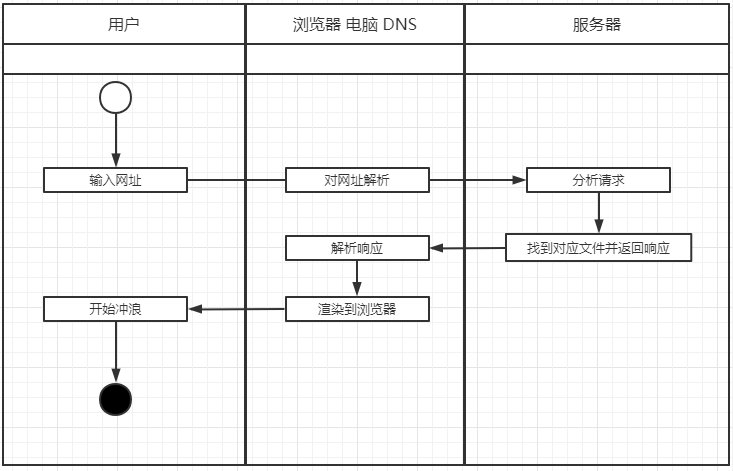
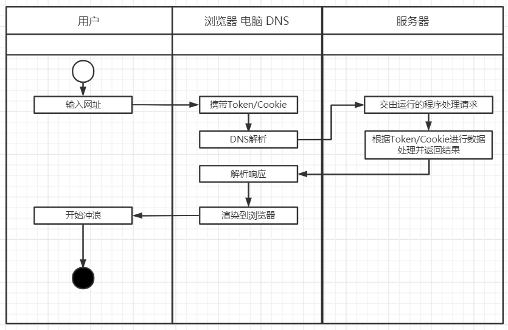

## 什么是网页

### 网页基础内容

在上一篇我们说到了HTML（超文本标记语言），以前网络上大部分网站都是由HTML以及一些多媒体元素构成的，这些多媒体元素在行业内一般称为"静态资源"，如图片，视频，音频等。下面用一张图来简单说明一下一个网站内容的构成。



```text
.
+-- bootstrap-4.3-1-dist //下载的第三方内容 提供了css，js等文件
+-- css //用来放自己写的给网站用的样式 如上篇提到的 style=color: red
+-- img //存放网站会用到的图片 image的缩写
+-- js  //一些网站会用到的脚本 不用在意
+--+
|  | 各种.html代表了不同的页面
|
+-- README.md //说明文档
```

我们打开这个index.html（还记得上篇写的HTML语句吗，你们也可以在自己的电脑上打开试试），然后注意浏览器地址栏部分，它指向了这个index.html文件于我电脑上所在的目录。



浏览器的地址栏里面的内容称为URL（Uniform Resource Locator 统一资源定位符），俗称网址。通常是以

> 协议名://主机名:端口号/路径/具体文件
>
> 如 http://localhost:8080/web.html 代表以http协议去请求主机为localhost（localhost就是本机ipv4是127.0.0.1）在端口8080上的web.html文件

这样的形式来访问互联网上某个开放的资源。这里面比较陌生的是端口号，平时咱们上网几乎没有输入过端口号，这是因为在URL中我们指定了协议是HTTP，而HTTP协议默认就是去请求主机的80（8080）端口，顺带一提，HTTPS协议默认请求443端口。

### 静态网页 动态网页

讲到这里还不得不提一下静态网页和动态网页，我们的博客主要就是要以静态的形式来实现。

首先各位需要理解一个概念，这里的静态动态并**不是以网页所展示的形式来决定的，而是以页面内容提供的方式和用户交互来区别的**。



可以看到，用户访问某个静态网页面时服务器直接将这个页面返回到了用户机上，对于不同的用户来说，访问这个页面得到的都是同样的结果，也许这个页面有许多动画或者响应的效果，但是从用户交互和内容提供的方式来看，这个页面是静态的。

那么动态网页是怎么样的呢？



可以看到，在这个例子中，动态网页的区别之一在于用户的请求附带了Token或者Cookie（这两个东西可以理解为用户在这个网站上的一些需要持续使用的信息，常用来保持登录状态，获取当前登录用户信息等等），之二就是服务器上运行的程序对用户的请求做了处理之后再返回了给浏览器能解析渲染的数据，这类程序我们往往称之为网站后端。

为了比较直观的解释动静之区别，我对网页请求的方式做了非常多的简化。动态网页除了后端一般还会有一套前端用来展示数据和交互，静态网页也可以通过JavaScript脚本来做一些数据处理展示，但本质和动态网页是不同的。

#### 两者的优劣 选择Hugo

大概了解了动态网页和静态网页的区别过后，我们就可以说一下为什么选择Hugo这类框架来写博客了。

动态网页的博客框架如WordPress，我大一的时候试着用WordPress搞了一下博客，它的优势在于，你可以在网站的后台直接写文章发布，然后在后台进行文章管理，分类，删除更新等等，你也可以对每位来阅读的用户进行个性化处理，比如对他们的评论在系统后台进行审核，还有其它优势不一一列举。

它的劣势也比较明显，功能丰富使得它相对于静态网页框架更加复杂，对于萌新来说各种安装的过程就已经足够把人搞得晕头转向了，而且作为一个独立运行的程序，它还需要用户自己有一台稳定的服务器可以使用，单单提供静态页面托管能力的GitHub，Gitee就无法胜任这份工作了，而且各种维护也使得它有些脱离了博客最单纯的目的，写文章。

而静态博客框架如Hugo基本上就是上面所述内容的反面，功能相对简单，如评论系统需要借助JavaScript脚本去接入第三方的评论系统，无法在本地管理这些数据，写文章也需要自己在本地建立MarkDown文件来编写后通过命令生成静态页面后发布，没有那么方便。

优点也很明显，简单易上手，轻量化，不需要服务器，专注写作本身。

也正是基于这些原因所以非常推荐大家使用Hugo来建立自己的博客。
