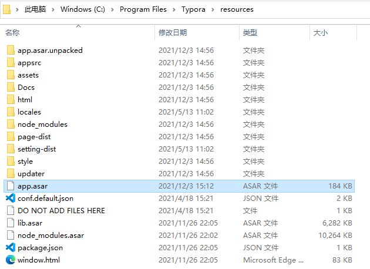

### 1. 需要`python`环境，没有的话自行安装一下

### 2. 克隆脚本文件 https://github.com/Mas0nShi/typoraCracker.git

```bash
打开命令行工具(win+R 输入 cmd)
git clone https://github.com/Mas0nShi/typoraCracker.git
```


安装依赖

```bash
pip install -r requirement.txt
```

### 3. 找到Typora安装目录下的`resources`目录下的`app.asar`文件

默认应该是在 `C:\Program Files\Typora\resources\app.asar`



### 4. 执行解包命令：

Windows下如果路径是有空格的，需要用`""`包起来，如果提示权限问题，用管理员身份运行命令行，建议后续都用管理员身份执行。

```bash
python typora.py "C:\Program Files\Typora\resources\app.asar" workstation\outfile\
```


### 5. 使用脚本文件夹`example\path\License.js`替换掉`workstation\outfile\dec_app\License.js`文件


### 6. 打包`app.asar`文件

```undefined
python typora.py -u workstation\outfile\dec_app workstation\outappasar
```

我直接执行会报错:

```shell
PS C:\Code\mine\typoraCracker> python typora.py -u workstation/outfile/dec_app workstation/outappasar
2021-12-03 15:25:59.623 | ERROR | __main__:packWenc:103 - plz input Directory for app.asar
Traceback (most recent call last):
  File "C:\Code\mine\typoraCracker\typora.py", line 151, in <module>
 main()
  File "C:\Code\mine\typoraCracker\typora.py", line 146, in main
 args.mode(args.asarPath, args.dirPath, args.format)
  File "C:\Code\mine\typoraCracker\typora.py", line 104, in packWenc
 raise NotADirectoryError
NotADirectoryError
```

手动在脚本路径下创`workstation/outappasar`文件夹就行了:

```bash
mkdir workstation/outappasar
python typora.py -u workstation\outfile\dec_app workstation\outappasar
```

### 7. 将打包回来的`app.asar`文件重新丢到`Typora`的`resources`目录下

### 8. 授权码生成

需要安装`nodejs`环境，如果没有安装请自行安装。

```bash
验证node安装:
node -v
node example/keygen.js
```


### 9. 激活

授权码输入生成的码，邮箱输入`crack@example.com`，完事。
