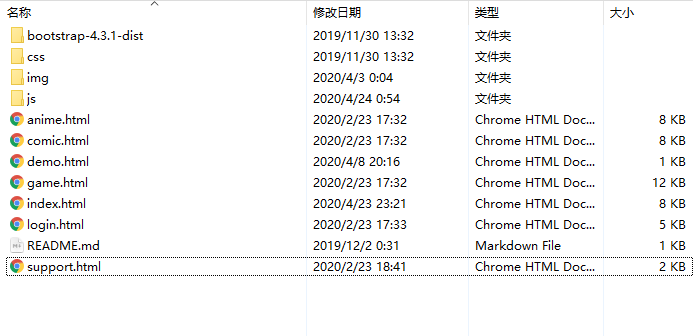
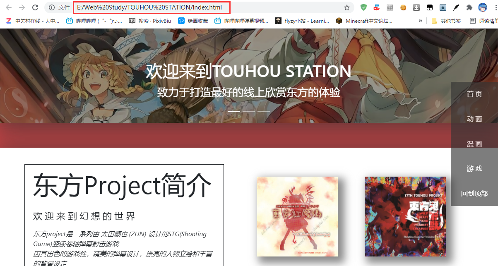
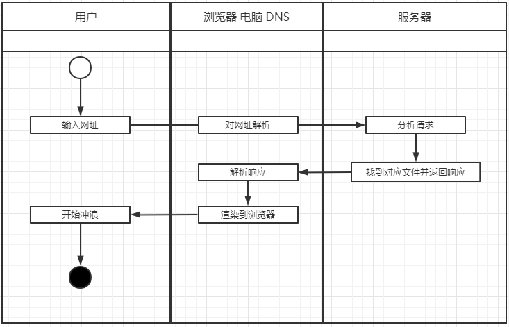

## 什么是网页

### 网页基础内容

在上一篇我们说到了HTML（超文本标记语言），以前网络上大部分网站都是由HTML以及一些多媒体元素构成的，这些多媒体元素在行业内一般称为"静态资源"，如图片，视频，音频等。下面用一张图来简单说明一下一个网站内容的构成。



```text
.
+-- bootstrap-4.3-1-dist //下载的第三方内容 提供了css，js等文件
+-- css //用来放自己写的给网站用的样式 如上篇提到的 style=color: red
+-- img //存放网站会用到的图片 image的缩写
+-- js  //一些网站会用到的脚本 不用在意
+--+
|  | 各种.html代表了不同的页面
|
+-- README.md //说明文档
```

我们打开这个index.html（还记得上篇写的HTML语句吗，你们也可以在自己的电脑上打开试试），然后注意浏览器地址栏部分，它指向了这个index.html文件于我电脑上所在的目录。



浏览器的地址栏里面的内容称为URL（Uniform Resource Locator 统一资源定位符），俗称网址。通常是以

> 协议名://主机名:端口号/路径/具体文件
>
> 如 http://localhost:8080/web.html 代表以http协议去请求主机为localhost（localhost就是本机ipv4是127.0.0.1）在端口8080上的web.html文件

这样的形式来访问互联网上某个开放的资源。这里面比较陌生的是端口号，平时咱们上网几乎没有输入过端口号，这是因为在URL中我们指定了协议是HTTP，而HTTP协议默认就是去请求主机的80（8080）端口，顺带一提，HTTPS协议默认请求443端口。

### 静态网页 动态网页

讲到这里还不得不提一下静态网页和动态网页，我们的博客主要就是要以静态的形式来实现。

首先各位需要理解一个概念，这里的静态动态并不是以网页所展示的形式来决定的，而是以页面内容提供的方式和用户交互来区别的。


